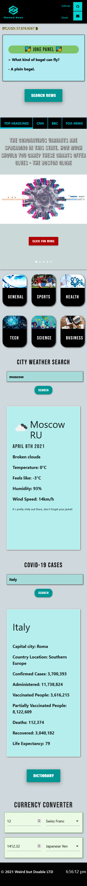
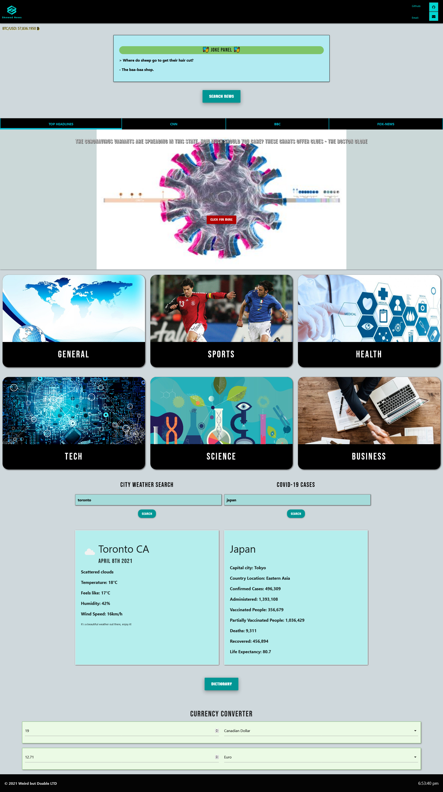

# SkewedNews

# About us
The group decided to implement an application that would draw from different news API'S and display those articles to the screen. Being that it is a news application, some other `API`'s were also added.

## The problem
* In the current political climate in most of the world, news has become increasingly biased. This application shows news sources from three different sources and displays the articles from each.
* The application does not attempt to solve the problem of news being biased towards one political party or another. It, however, does bring attention to the types of language and instruments of persuasion used within the news articles. 
* Each news source has their own political leanings and its up to the user the figure out what they may be. However, to simplify things, the fox-news source is extremely right wing, the CNN news source is more neutral to right wing and the last BBC is more neutral to left. 
* As the reader goes through each news source, they will notice the language used is politically motivated to their party of choice. Even though this is subtle and hardly noticeable at the beginning. People become persuaded over time.  

## The extra
The application provides links to the three different news sources as well as various categories. These categories include, general, sports, health, technology, science and business. 

## Problems Encountered
* Skewed News was not our first idea. We first decided to try and make an application that would help fishing tournaments however, getting the right `API` for our needs weren't accesible so we had to scrap that idea for now.
* We turned our efforts towards making the Skewed News application. The major issue for this application was finding an API that would allow us to use a key word search option.
* All the news API'S were designed to give articles and only allowed key work searches if the user signed up for a paid subscription. We eventually found a news API that allowed to search by source and this application would see the light of day.
* Many of the issues within the development of the application had to do with conflicing code. Some of the components added, conflicted with others. These issues were quickly rectified.

## Technologies used
  As a styling framework, Materialize was used. Multiple components were used, a carousel, modal, form and cards were all pulled upon. 

## APIs used: 
    Currency converter: https://ratesapi.io
    Bitcoin value: https://www.coindesk.com/
    News sources: https://documenter.getpostman.com/view/3479169/Szf7zncp?version=latest
    Weather: https://openweathermap.org/

## Live link
<a href="https://weird-but-doable.github.io/SkewedNews/">Live Website</a> 

## Wireframe link
<a href="https://drive.google.com/file/d/1as-u8TPpsL6aeiCMIf8TxA0N6DYWeBF4/view?usp=sharing">Wireframe</a> 

## Presentation
https://docs.google.com/presentation/d/11swhMJC37M_jzSltpU1qi0uJBUiIePb3dWuShX4RrB0/edit?usp=sharing 

## Screenshots 

### License:

Copyright © Weird But Doable. All rights reserved.
Licensed under the [MIT](https://github.com/Weird-but-Doable/SkewedNews/blob/main/LICENSE) license.
